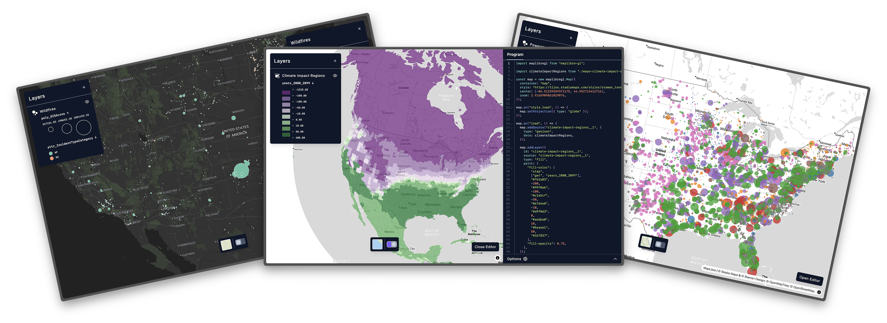

  

  

[**cartokit**](https://alpha.cartokit.dev) is a direct manipulation programming system for interactive cartography on the web. Try it now at [alpha.cartokit.dev](https://alpha.cartokit.dev), read the [docs](https://docs.cartokit.dev), or watch the [demo](https://vimeo.com/1142886499?share=copy&fl=sv&fe=ci).

## Cartography with cartokit

Many cartographers make heavy use of direct manipulation interfaces for map design. Whether these are built-in cartography tools in [QGIS](https://www.qgis.org/en/site/) or [ArcGIS](https://www.qgis.org/en/site/), vector editing software like Figma or Adobe Illustrator, or style specification editors like [Mapbox Studio](https://www.mapbox.com/mapbox-studio) or [Maputnik](https://maputnik.github.io/), direct manipulation tools help us create maps faster.

As cartography has shifted to the web, however, our material for mapping has expanded. We can now make maps by writing **programs** in addition to working with static media. Libraries like [D3](https://d3js.org/), [Leaflet](https://leafletjs.com/), and [MapLibre GL JS](https://maplibre.org/maplibre-gl-js/docs/) are incredibly powerful for data-intensive mapping on the web. However, these tools also have steep learning curves—you need to be a proficient JavaScript developer just to get started.

Could we have the best of both worlds? Can we give users access to rich direct manipulation interfaces for styling maps while _automatically_ writing programs for them? This is cartokit's central goal.

## System Goals

First and foremost, cartokit is a direct manipulation programming environment for interactive cartography. You edit elements of the map directly and cartokit takes care of writing a JavaScript (or TypeScript!) program to reproduce that map. In addition, cartokit seeks to:

- **Make it simple and efficient to visualize geospatial data using different cartographic representations.** Want to see your data as a choropleth map? Maybe a proportional symbol (bubble) map? How about heatmaps? cartokit will do the heavy lifting of transforming your geospatial data on-the-fly, making it possible to explore a wide space of map designs in a few clicks.
- **Apply sound cartographic practices by default.** Unsure how to scale proportional symbols accurately? Concerned about picking a color scheme? How do you compute quantiles again? cartokit bakes in best cartographic practices to guide you into the pit of mapping success.
- **Give access to the underlying program, always.** It's frustrating to use a tool and hit the point where it doesn't have support for that one thing you want. cartokit gives you access to a plain JavaScript or TypeScript program—using MapLibre GL JS or Mapbox GL JS—to reproduce the current map exactly as it appears. Use cartokit when it works for you, and take your JS program to your text editor when it doesn't!

## Demo

For a deeper dive into how cartokit works—and to see how you can get started programming with cartokit—check out the extended demo.

  <video
    src="assets/cartokit-demo.mp4"
    controls
    width="800"
    style="
      border: 1.5px solid #0f172b;
      border-radius: 0.25rem;
      box-shadow:
        0px 2.5px 8px 0px rgba(24,37,72,0.09),
        0px 1.5px 4px 0px rgba(60,60,67,0.045);
      background: #fff;
      margin: 0 auto;
      display: block;
    "
  >
    Your browser does not support the video tag.
  </video>

