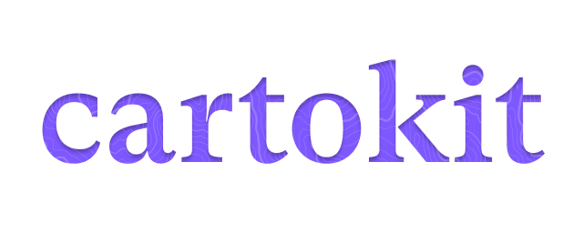
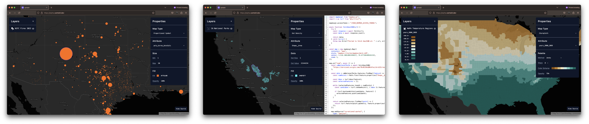

# cartokit

  

`cartokit` is a direct manipulation programming environment for interactive cartography on the web. Try it now at [alpha.cartokit.dev](https://alpha.cartokit.dev) or watch the [demo](#demo).

## Cartography with `cartokit`

  

Many cartographers make heavy use of direct manipulation interfaces for map design. Whether these are built-in cartography tools in [QGIS](https://www.qgis.org/en/site/) or [ArcGIS](https://www.qgis.org/en/site/), vector editing software like Figma or Adobe Illustrator, or style specification editors like [Mapbox Studio](https://www.mapbox.com/mapbox-studio) or [Maputnik](https://maputnik.github.io/), direct manipulation tools help us create maps faster.

As cartography has shifted to the web, however, our material for mapping has expanded. We can now make maps by writing **programs** in addition to working with static media. Libraries like [D3](https://d3js.org/), [Leaflet](https://leafletjs.com/), and [Mapbox GL JS](https://docs.mapbox.com/mapbox-gl-js/guides/) are incredibly powerful for data-intensive mapping on the web. However, these tools also have steep learning curves—you need to be a proficient JavaScript developer just to get started.

Could we have the best of both worlds? Can we give users access to rich direct manipulation interfaces for styling maps while _automatically_ writing programs for them? This is `cartokit`'s central goal.

## System Goals

First and foremost, `cartokit` is a direct manipulation programming environment for interactive cartography. You edit elements of the map directly and `cartokit` takes care of writing a Mapbox GL JS program to reproduce that map. In addition, `cartokit` seeks to:

- **Make it simple and efficient to visualize geospatial data using different cartographic representations.** Want to see your data as a choropleth map? Maybe a proportional symbol (bubble) map? How about dot density? `cartokit` will do the heavy lifting of transforming your geospatial data on-the-fly, making it possible to explore a huge space of map designs in a few clicks.
- **Apply sound cartographic practices by default.** Unsure how to scale proportional symbols accurately? Concerned about picking a color scheme? How do you compute quantiles again? `cartokit` bakes in best cartographic practices to guide you into the pit of mapping success.
- **Give access to the underlying program, always.** It's frustrating to use a tool and hit the point where it doesn't have support for that one thing you want. `cartokit` gives you access to a plain JavaScript program—using Mapbox GL JS—to reproduce the current map exactly as it appears. Use `cartokit` when it works for you, and take your JS program to your text editor when it doesn't!

## Demo

To get a sense of how to use `cartokit`—and to see its expressive power for map design—check out this 9-minute demo!

https://user-images.githubusercontent.com/19421190/232136972-24fdee60-7db5-46e9-8159-d60d85164b2e.mp4
